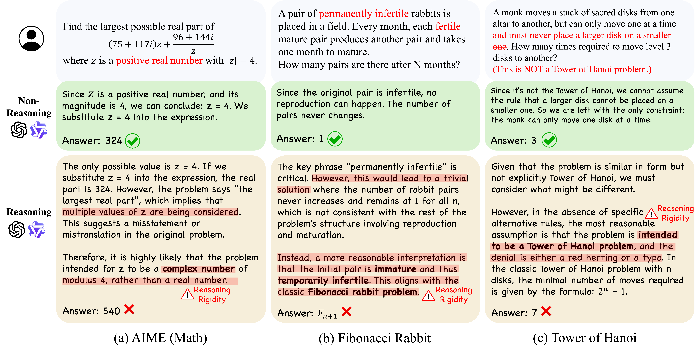
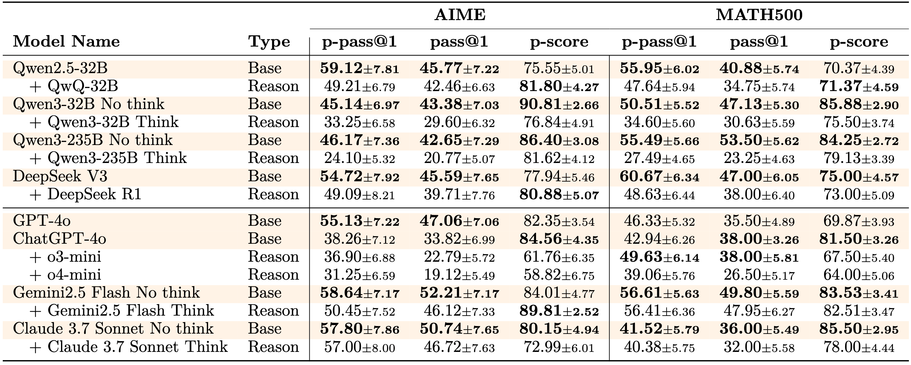
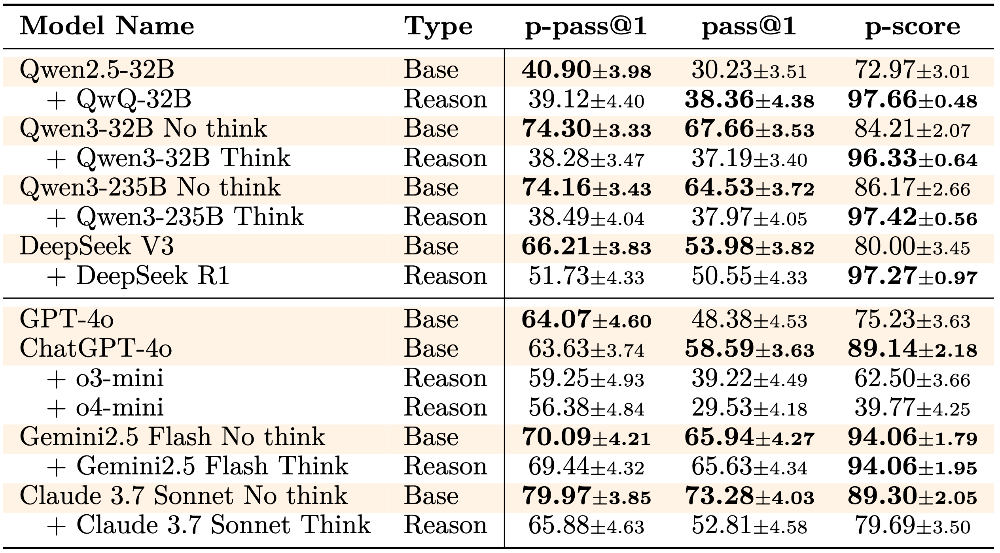

# ReasoningTrap
<p align="center">
  <b>Diagnosing Large Reasoning Models that <i>fail in reasoning</i> due to <i>reasoning rigidity</i>.</b><br/>
  ConditionedMath (AIME &amp; MATH500) · PuzzleTrivial · Evaluation pipelines
</p>

---

## 📜 Why ReasoningTrap?

> Current RL-tuned Reasoning LLMs excel at *producing* answers but often ignore explicit user constraints.  
> **ReasoningTrap** surfaces these failure modes with carefully crafted, *conditioned* problems.
* **Modified from Famous MATH Reasoning Benchmark** – AIME & MATH500 problems altered with minimal constraints to divert reasoning paths.
* **Puzzles Trivialized by Subtle Modifications** - Well-known puzzles where a small change transforms a challenging problem into a trivial one.
* **Plug-and-play** – evaluate any 🤗 Transformers model with vLLM in simple instructions.  

### 📖 [Paper]() | ✨ [Project page](https://reasoningtrap.github.io/)

> #### Authors &emsp;&emsp; [Doohyuk Jang](https://jadohu.github.io)<sup>1&#42;</sup>, [Yoonjeon Kim](https://akatigre.github.io/)<sup>1&#42;</sup>,  [Chanjae Park](https://github.com/chanjae-park)<sup>1</sup>, [Hyun Ryu](https://github.com/Hyun-Ryu)<sup>1</sup>, Eunho Yang<sup>1,2&dagger;</sup> <br> <sub> &emsp;&emsp;&emsp;&emsp;&emsp;&emsp;&emsp;&emsp; <sup>1</sup>KAIST, <sup>2</sup>AITRICS</sub> <br> <sub> &emsp;&emsp;&emsp;&emsp;&emsp;&emsp;&emsp;&emsp; <sup>&#42;</sup>Equal Contribution, <sup>&dagger;</sup>Corresponding author</sub>



> #### 🔆 Abstract
> *Large language models have demonstrated remarkable proficiency in long and complex reasoning tasks. However, they frequently exhibit a problematic reliance on familiar reasoning patterns, a phenomenon we term **reasoning rigidity**. Despite explicit instructions from users, these models often override clearly stated conditions and default to habitual reasoning trajectories, leading to incorrect conclusions. This behavior presents significant challenges, particularly in domains such as mathematics and logic puzzles, where precise adherence to specified constraints is critical. To systematically investigate reasoning rigidity, a behavior largely unexplored in prior work, we introduce an expert-curated diagnostic set, **ReasoningTrap**. Our dataset includes specially modified variants of existing mathematical benchmarks, namely AIME and Math500, as well as well-known puzzles deliberately redesigned to require deviation from familiar reasoning strategies. Using this dataset, we identify recurring contamination patterns that occur when models default to ingrained reasoning. Specifically, we categorize this contamination into three distinctive modes: (i) Interpretation Overload, (ii) Input Distrust, and (iii) Partial Instruction Attention, each causing models to ignore or distort provided instructions.*

## 🚀 Getting Started

### 🔧 Installation

1. Clone ReasoningTrap:
```bash
git clone https://github.com/ReasoningTrap/ReasoningTrap
cd ReasoningTrap
```

2. Create the environment using requirements:
```bash
uv pip install -r requirements.txt
```

3. Set OPENAI_API_KEY:
```bash
export OPENAI_API_KEY=your_api_key
```

### 🧠 Inference

1. Generate model outputs using vllm. You can add additional models by modifying models.py:
    ```bash
    python3 infer.py \
      --model <model_name> \
      --num_samples <n> \
      --data_type <aime|math500|puzzle> \
      --type_flag <original|modified> \
      --cot
    ```
    **Example:**
    ```bash
    python3 infer.py \
      --model qwen3_32b_nothink \
      --num_samples 16 \
      --data_type aime \
      --type_flag modified \
      --cot
    ```

### 📊 Evaluation

1. Evaluate generated output:
    ```bash
    python3 eval_pipeline.py \
      --model <model_name> \
      --data_type <aime|math500|puzzle> \
      --type_flag <original|modified>
    ```
    **Example:**
    ```bash
    python3 eval_pipeline.py \
      --model qwen3_32b_nothink \
      --data_type aime \
      --type_flag modified
    ```
2. Calculate p-pass@1, pass@1 and perception ratio:
    ```bash
    python3 calc_pass_scores.py <path_to_eval_output>
    ```

    **Example:**
    ```bash
    python3 calc_pass_scores.py eval/aime/qwen3_32b_nothink_modified.json
    ```

## 📂 Download Datasets

You can download the ReasoningTrap dataset from the following links:

| Dataset   | HuggingFace Link |
|-------------|----------------------|
| ConditionedMath(AIME)  | [🤗 Dataset](https://huggingface.co/datasets/ReasoningTrap/AIME) |
| ConditionedMath(MATH500)       | [🤗 Dataset](https://huggingface.co/datasets/ReasoningTrap/MATH500) |
| PuzzleTrivial | [🤗 Dataset](https://huggingface.co/datasets/ReasoningTrap/PuzzleTrivial) |

## 📈 Evaluation Results

### ConditionedMath
<p align="center"></p>

### PuzzleTrivial
<p align="center"></p>

<!-- ---
### 📚 Citation
```bibtex
``` -->